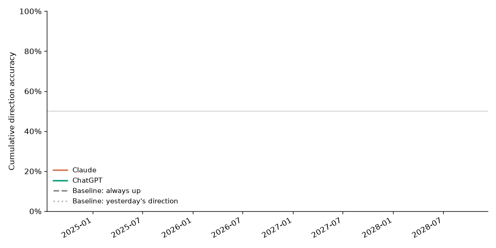

# Claude vs ChatGPT 预测对比

统计区间：2026-09-29 ~ 2026-09-29，共 1 个交易日（只统计开盘前提交的预测）

> ⚠️ 目前只有 1 个交易日，少于 60 天，胜负主要是噪音，仅供参考。

## 总成绩

| 选手 | 样本数 | 方向准确率 | Brier ↓ | 涨跌幅误差 ↓ |
|---|---|---|---|---|
| Claude | 3 | 100.0% | 0.189 | 0.09% |
| ChatGPT | 3 | 66.7% | 0.204 | 0.24% |
| 基准·永远猜涨 | 3 | 66.7% | — | 0.71%（猜 0%） |
| 基准·照搬昨天 | 3 | 33.3% | — | 0.71%（猜 0%） |

- **方向准确率**：猜对涨跌的比例。要明显高于两个基准才算有真本事。
- **Brier**：概率预测的误差，越低越好；每次都报 50% 的得分是 0.250。
- **涨跌幅误差**：预测涨跌幅和实际的平均绝对差，越低越好。基准一栏是"每天都猜 0%"的误差。

## 正面对决

- 同场比较样本：**3** 条（同一天、同一标的，两边都有有效预测）
- 两边方向判断**不一致**的有 1 条：Claude 对了 1 次，ChatGPT 对了 0 次（二项检验 p = 1.000）
- 逐条比 Brier：Claude 更好 2 次，ChatGPT 更好 0 次（p = 0.500）
- 平均 Brier：Claude 0.189 vs ChatGPT 0.204
- 目前两项差异都**不显著**，还不能说谁更准。

## 分标的

| 标的 | 选手 | 样本 | 准确率 | Brier | 误差 |
|---|---|---|---|---|---|
| INTC | ChatGPT | 1 | 0.0% | 0.250 | 0.39% |
| INTC | Claude | 1 | 100.0% | 0.230 | 0.21% |
| MU | ChatGPT | 1 | 100.0% | 0.160 | 0.15% |
| MU | Claude | 1 | 100.0% | 0.160 | 0.05% |
| SNDK | ChatGPT | 1 | 100.0% | 0.203 | 0.18% |
| SNDK | Claude | 1 | 100.0% | 0.176 | 0.01% |

## 走势

## 最近 10 个交易日

| 日期 | 标的 | 实际 | Claude | ChatGPT |
|---|---|---|---|---|
| 2026-09-29 | INTC | -0.09% | ✅ -0.3%（48%涨） | ❌ +0.3%（50%涨） |
| 2026-09-29 | MU | +1.05% | ✅ +1.0%（60%涨） | ✅ +1.2%（60%涨） |
| 2026-09-29 | SNDK | +0.98% | ✅ +1.0%（58%涨） | ✅ +0.8%（55%涨） |
